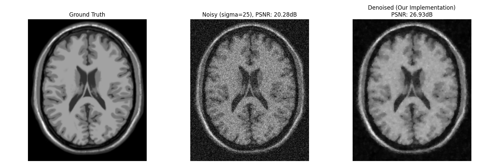

# Rician Noise Denoising (Liu, 2022)

基于全变分（Total Variation）和球面分解的 Rician 噪声去噪算法复现项目。

本项目是非官方的 Python 实现版本，原论文为：
> **Variational Rician Noise Removal via Splitting on Spheres** > *Zhifang Liu, Huibin Chang, Yuping Duan* (SIAM J. IMAGING SCIENCES, 2022)

## 📖 项目简介

基于 ADMM 算法的磁共振成像（MRI）莱斯噪声（Rician Noise）去噪复现项目。本项目复现上述 SIAM Journal on Imaging Sciences 论文的 Algorithm 4.1。

### ✨ 核心亮点：
1. **数学对齐**：针对 Rician 噪声的非凸性，实现了基于 Splitting on Spheres（球面分裂） 的 ADMM 求解器，避开了复杂的 Bessel 函数求导。
2. **物理真实性**：适配 BrainWeb 原始二进制数据集（.raws），处理了 Little-Endian 字节序与 Fortran-style 内存排列问题。
3. **专业评估**：实现了 Foreground Masking（前景掩码） 评估准则，排除了背景区域 Rayleigh 噪声对 PSNR 统计的干扰，确保与论文实验结果对齐。


## 📁 项目结构

```text
RicianDenoising_Liu2022/
├── data/               # 存放 BrainWeb .raws 数据
├── src/
│   ├── models/         # 能量泛函定义
│   ├── solvers/        # RicianSolver 核心算法类
│   │   └── __init__.py
│   ├── operators.py    # forward_gradient, backward_divergence 等算子
│   └── utils.py        # 数据读取、Rician 加噪、前景 PSNR 计算
├── tests/              # 单元测试（数据加载与算子伴随性验证）
├── main.py             # 一键运行脚本
└── README.md
```

## ⚙️ 环境依赖

请确保您的环境中安装了 Python 3.7+。建议使用虚拟环境运行，执行以下命令安装所需核心依赖：

```bash
pip install numpy scipy scikit-image matplotlib opencv-python
```

## 🚀 快速开始

克隆本项目后，直接运行主入口文件即可查看去噪效果：

```bash
python main.py
```

代码会自动加载默认的测试图像（Brain），添加 $\sigma=25$ 的 Rician 噪声，使用论文参数 `alpha=0.01`、`beta=0.045`、`r=1`、`c=2` 运行 Algorithm 4.1，最多迭代500次并按相对误差提前停止。

## 📊 实验结果

实验采用从Brainweb上获取的模拟MRI图像，在 $\sigma=25$ 的 Rician 噪声(固定seed=45)下，brain 图像的恢复效果如下：

* **Noisy Image**: PSNR $\approx 20.28$ dB, SSIM $\approx 0.6641$
* **Restored Image**: PSNR $\approx 26.76$ dB, SSIM $\approx 0.8766$



## 📜 参考文献

* Liu, Z., Chang, H., & Duan, Y. (2022). Variational Rician Noise Removal via Splitting on Spheres. *SIAM Journal on Imaging Sciences*, 15(2), 524-549. [DOI: 10.1137/21M1432194]
